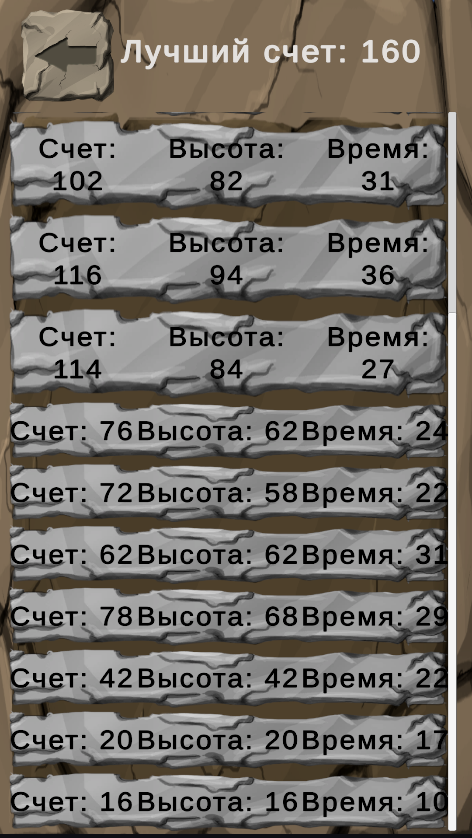

# OnlyJump
Репозиторий с мобильной игрой под андроид в жанре 2д платформер. Цель игры забираться все выше по платформам висящим в воздухе, пока не поглотила лава с низу. Чем выше поднимешься и чем быстрее это делаешь тем больше очков получишь. Так же с высотой становится больше врагов и все более опасные платформы. При написании кода придерживалс принципов SOLID. 

# Геймплей
- Игрок прыгает по платформам, что автоматически появляются выше и исчезают ниже игрока. Для того, чтобы не плодить мусор эти платформы работают через object pool.
- Все платформы спавнятся генератором уровня, в котором прописаны условия их спавна в зависимости от высоты на которую забралс игрок. Так же от высоты зависят и противники что спавнятся на платформах
- Всего существует 5 типов платформ. Далее они указаны в порядке появления по высоте. Обычная, исчезающая, платформа с шипами, летающая и вертикальная от которой можно отпрыгнуть, но если на ней находится, то соскальзываешь вниз.
- Противников 4 вида. Так же указыны в порядке появления. Неподвижный по центру платформы, бродячий по платформе, сидячий на стене и атакующий снарядами и летающий от стенки до стенки.
- Начало новой игры скидывает счет. Сам счет зачитывается после каждой смерти.
- Если прыгнуть на врага сверху, то ты не получишь урон и подлетишь вверх для преодоления нескольких платформ за раз.
- Лава сразу отнимает всё здоровье, по этому попадание в нее смертельно.
- Данные в игре хранятся в scriptable object. Между сессиями сохраняются в Яндекс плагин.
- Есть 30 проходимых уровней, за каждый можно получить 3 звезды
- Можно выбрать язык в меню настроек, а так же повысить/понизить громкость игры
- Создана панель достижений. Всего 15 штук
  
# Скриншоты и геймплей

 

